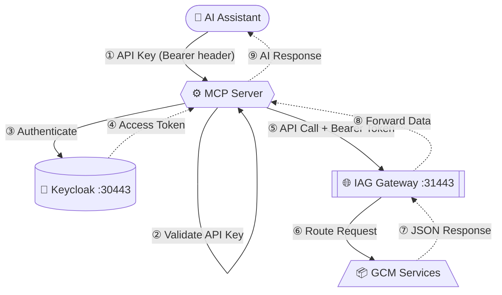

# GCM MCP Server 
This is the Fork of the repository stored in the ibm/mcp-servers do achive certain functionality which was missing and contains workaround and not the actual fix. see the published repo click [here](https://github.com/IBM/gcm-mcp-server)

## Architecture



**How it works — step by step:**

| Step | What happens |
| ---- | --------------------------------------------------------------- |
| ① | AI assistant sends a request to MCP Server **with API key in the `Authorization` header** |
| ② | MCP Server **validates the API key** — rejects with `401 Unauthorized` if missing or wrong |
| ③ | MCP Server sends GCM credentials to Keycloak (GCM's identity provider) |
| ④ | Keycloak validates and returns an `access_token` (5 min TTL) |
| ⑤ | MCP Server calls IAG Gateway with `Bearer <token>` |
| ⑥ | IAG routes the request to the correct GCM microservice |
| ⑦ | GCM service processes and returns JSON |
| ⑧ | IAG passes the response back to MCP Server |
| ⑨ | MCP Server formats and returns the answer to the AI assistant |

---

#### Setup
Currently, only local setup is supported as we are fulling the file for upload from local machine using absolute path. even the docker setup isnt supported.

#### Running locally

1. create .env file
```sh
cp .env.example .env
```

2. Create python venv
```sh
python -m venv venv
source venv/bin/activate
pip install -r requirements.txt
```

3. Run the server
```sh
python server.py --transport sse
```

#### Generating Admin token for usuage ()
```sh
curl -X POST http://localhost:8002/admin/keys \
  -H "Content-Type: application/json" \
  -d '{"user": "john"}'
```

#### MCP config to be pasted in bob ide
```sh
    "gcm-mcp-server": {
        "type": "sse",
        "url": "http://localhost:8002/sse",
        "headers": {
            "Authorization": "Bearer <token-received-above>"
        },
        "disabled": true,
        "alwaysAllow": []
    }
```
